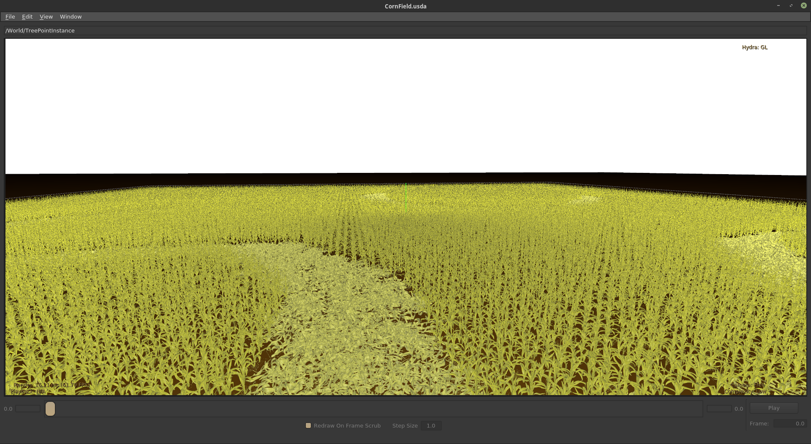
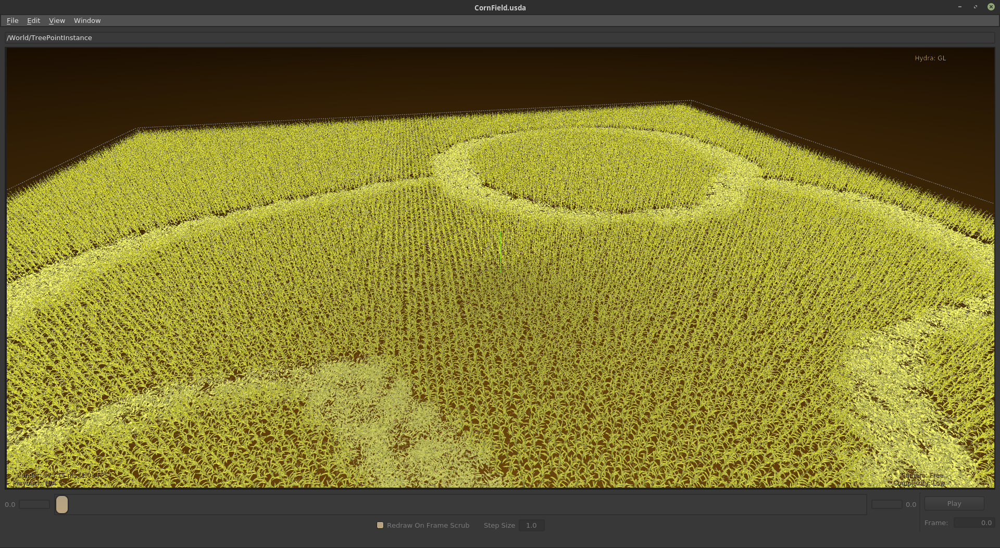

# Crop Circles

This demo loads up a map and generates a scene with crop circles using USD. The inital corn model is from [https://free3d.com/](https://free3d.com/) the crushed version was generated by turning it into cloth then dropping it onto a plane in maya. Both were exported to usd using the Pixar USD plugin.

